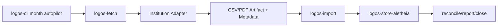

# ADR 0003: Headless Statement Fetch and Autopilot Integration

Date: 2026-03-09  
Status: Accepted

## Context

`logos` already supports local statement import plus month reconciliation/close, but the current `month autopilot` flow still depends on the operator manually logging into institutions, downloading CSV/PDF statements, and typing statement balances. Plaid is not a viable integration path for this project, so the automation boundary has to live on the user's machine and work directly against institution websites and downloaded statement artifacts.

The target workflow is headless/background-first. It must support multiple institutions, tolerate partial failure, and avoid smearing browser automation concerns across the accounting runtime. It also needs a sane secret model for locally stored credentials and TOTP where unattended execution is possible.

## Decision

1. Add a dedicated `logos-fetch` workspace crate for statement-source config, secret references, adapter execution, artifact staging, metadata extraction, and fetch-run status reporting.
2. Keep `logos-cli` as the workflow orchestrator: `month autopilot` will run fetch first, then hand local artifacts plus extracted balances/date windows into the existing import/reconcile/report/close pipeline.
3. Use institution-specific browser automation adapters for v1 instead of Plaid or undocumented direct HTTP scraping.
4. Store only 1Password secret references in config, never raw credentials. Adapters resolve secrets at runtime via the local `op` CLI. TOTP-backed unattended execution is supported only when the seed can be stored in 1Password; otherwise the source is explicitly treated as `needs_attention`.
5. Treat partial success as first-class. One failed institution must not poison unrelated sources; autopilot continues for the rest and blocks close only where statement evidence is still missing or untrusted.

## Consequences

Positive:

- Browser automation complexity is isolated from the ledger core instead of becoming a CLI flag landfill.
- Headless monthly runs can fetch statements and extracted balances without manual logins when the institution/MFA path allows it.
- Partial-failure status becomes auditable instead of silently aborting the whole month workflow.

Tradeoffs:

- Institution adapters are operationally brittle and will need maintenance when sites change.
- True unattended runs depend on local secret hygiene and whether MFA can be re-homed into 1Password.
- `logos-fetch` introduces a second workflow boundary that must be tested with fake adapters before live browser runs.

## Operational Notes

- Config stores secret references such as `op://vault/item/field`, not raw usernames, passwords, or TOTP seeds.
- CSV is preferred over PDF when both are available; PDF remains a supported fallback artifact.
- Fetch runs must persist statuses such as `downloaded`, `no_new_statement`, `needs_attention`, and `failed` so operators can see which institutions need cleanup.
- Automatic month close is allowed only when fetched metadata is present and trusted enough to replace manually typed opening/closing balances.
