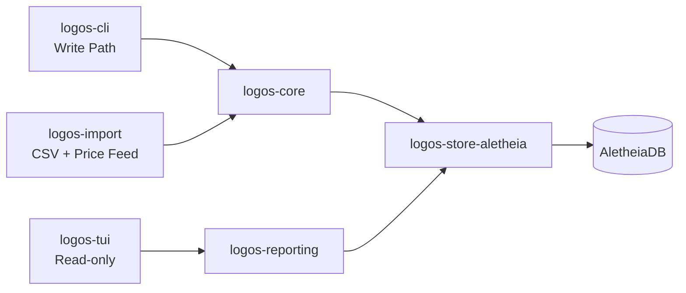

# Logos Ledger CLI/TUI Design (v0)

Date: 2026-02-22  
Status: validated for implementation  
Branch: `feat/ledger-cli-tui-foundation`

## 1. Scope and Intent

Build a personal finance forward-looking double-entry ledger and budgeting tool with:

- strict accounting correctness at write time
- read-focused TUI dashboards
- append-only correction semantics
- RSU-aware planning with conservative forecasting

This is a dogfooding tool, so we bias toward useful personal workflows over product hardening.

## 2. Locked Product Decisions

- Storage backend: AletheiaDB as primary source of truth (v0)
- Journal validation: strict write-time balancing
- Currency scope: single currency only
- Budget model: category envelopes with monthly rollover
- RSU planning model: envelope + variable income smoothing
- RSU planning policy: provisional forecast allowed
- RSU reference price: 30-day average close
- RSU haircut defaults (conservative):
  - `<30d`: 25%
  - `30-90d`: 40%
  - `>90d`: 55%
- Realized RSU allocation policy (auto default):
  - tax reserve 40%
  - smoothing buffer 30%
  - goals 20%
  - discretionary 10%
- TUI scope: read/review only
- Data entry: CSV import + CLI commands
- RSU forecasts: planning-only (no provisional ledger postings)
- Timestamp precision: local datetime
- Timezone policy: fixed home timezone
- Budget taxonomy: two-level hierarchy (`Group -> Category`)
- CLI style: verb-first
- Edit semantics: append-only corrections
- Import idempotency: deterministic fingerprint
- Account model: canonical accounting types with normal-balance enforcement
- Report scope:
  - net worth
  - cashflow
  - budget vs actual
  - account register
  - RSU forecast summary

## 3. System Architecture

Crates:

- `logos-cli`: command parsing, command dispatch, stdout/stderr contract
- `logos-tui`: read-only ratatui screens and navigation
- `logos-core`: domain model, validation, policies, invariants
- `logos-store-aletheia`: persistence adapter and query mappings
- `logos-import`: CSV mappings and idempotent ingestion
- `logos-reporting`: read models and report builders
- `logos-proof`: Verus specs/proofs for critical invariants

Write flow:

1. Parse command into typed domain command.
2. Validate preconditions in `logos-core`.
3. Enforce strict invariants (balanced transaction, policy validity, hierarchy validity).
4. Persist append-only records through `logos-store-aletheia`.

Read flow:

1. Query report projections in `logos-reporting`.
2. Render in CLI tables/json or TUI panels.

## 4. Domain Model and Bitemporal Semantics

Core entities:

- `Account`: id, name, type, normal balance, status
- `Transaction`: id, local datetime, description, metadata
- `Posting`: account_id, amount, side/value encoding
- `CorrectionLink`: `supersedes_id`, correction metadata
- `BudgetGroup`: id, name
- `BudgetCategory`: id, group_id, name
- `BudgetMonth`: month key + allocations/rollover state
- `RsuGrant` and `RsuVestingEvent`: grant-level schedule and vest events
- `PricePoint`: symbol, local date, close price
- `RsuPolicy`: haircut tiers, auto-allocation percentages, timezone
- `ImportFingerprint`: deterministic identity for idempotency

Bitemporal usage:

- `valid_time`: user-intended economic time (local datetime/date)
- `tx_time`: persistence/change time handled by Aletheia history

User-facing "edit" operations are mapped to correction append operations that supersede prior records. No destructive overwrite path is exposed at CLI level.

## 5. Invariants (Must Hold)

Journal/accounting:

- `INV-TXN-001`: each posted transaction balances exactly to zero
- `INV-TXN-002`: account references must exist and be active
- `INV-TXN-003`: canonical account type rules and normal balances are enforceable
- `INV-TXN-004`: single-currency only in v0

Correction/audit:

- `INV-CORR-001`: correction edge targets existing transaction
- `INV-CORR-002`: correction graph is acyclic
- `INV-CORR-003`: superseded lineage is traceable

Budget:

- `INV-BUD-001`: category belongs to exactly one group
- `INV-BUD-002`: monthly rollover conservation holds
- `INV-BUD-003`: budget month key uniqueness and consistency

RSU policy:

- `INV-RSU-001`: haircut tiers are ordered and non-overlapping
- `INV-RSU-002`: allocation percentages sum to 100
- `INV-RSU-003`: forecast operations do not mutate ledger balances

Import:

- `INV-IMP-001`: same fingerprint cannot create duplicate logical transactions

## 6. CLI Command Surface (v0)

Verb-first command layout:

- `ledger account add|list|show`
- `ledger txn add`
- `ledger txn correct <txn_id>`
- `ledger budget set <yyyy-mm> <group> <category> <amount>`
- `ledger budget close-month <yyyy-mm>`
- `ledger import csv <path> --mapping <file>`
- `ledger price import <path>`
- `ledger rsu event add|list`
- `ledger rsu policy show|set`
- `ledger report net-worth|cashflow|budget|register|rsu-forecast`

CLI contracts:

- data output to stdout
- errors to stderr
- non-zero exit code on failure
- `--json` available for all report/list commands

## 7. TUI Scope (Read-Only in v0)

Screens:

- Home dashboard: net worth trend + current-month budget summary + RSU forecast snapshot
- Budget view: group/category actual vs budget with rollover context
- Register view: account drill-down with time window filters
- RSU view: vest timeline + 30-day average price + haircut-adjusted forecast

No mutation actions are allowed in TUI for v0.

## 8. RSU Forecast and Realization Rules

Planning forecast:

- uses manual/CSV price data only in v0
- reference price = rolling 30-day average close
- applies conservative haircut tier by vest horizon
- produces budget projection values only

Realized flow:

- once RSU cash is realized, post normal ledger transaction(s)
- apply default auto allocation:
  - tax reserve 40%
  - smoothing buffer 30%
  - goals 20%
  - discretionary 10%

## 9. Verification Strategy (`logos-proof`)

`logos-proof` will contain Verus specs and proofs for critical invariant "spines":

- Proof A: accepted transaction implies balanced postings
- Proof B: correction lineage cannot create cycles
- Proof C: budget rollover conservation
- Proof D: haircut tier validity and coverage
- Proof E: RSU allocation sum correctness
- Proof F: forecast isolation from posted ledger balances

Proof-first workflow:

1. SPEC: define pre/postconditions and invariants in `logos-proof`.
2. PROOF: prove preservation lemmas and impossible-state exclusions.
3. RED: add failing runtime tests for public behavior.
4. GREEN: implement minimal runtime path in `logos-core`.
5. REFACTOR: keep proofs and tests passing.

## 10. Test Strategy

Unit tests:

- posting construction/validation
- account type and normal balance checks
- budget rollover math
- RSU tier and allocation validation

Property tests:

- balanced vs unbalanced posting generators
- rollover conservation over random sequences
- fingerprint idempotency under repeated imports

Integration tests:

- CLI command behavior (`txn add`, `txn correct`, `budget set`, `import csv`, reports)
- store adapter behavior against Aletheia-backed test harness
- JSON output contract stability (snapshot tests)

TUI tests:

- smoke tests for screen render + query wiring

## 11. Phased Implementation Plan

1. Workspace scaffolding and crate boundaries.
2. `logos-proof` + core transaction invariants + `txn add/correct`.
3. Budget hierarchy, monthly rollover, budget reports.
4. CSV import/mapping + deterministic dedupe.
5. RSU events, price import, haircut forecast, realization allocation.
6. Read-only TUI report screens.
7. Hardening: docs, lint, tests, coverage, performance checks.

## 12. Out of Scope for v0

- multi-currency/commodity accounting
- live market API integration
- TUI write/edit workflows
- advanced scenario optimizer beyond current RSU policy model
