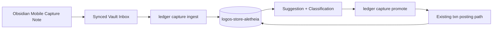

# Vault Capture Inbox Design

Date: 2026-03-11  
Status: Proposed

## Goal

Make transaction capture fast enough to use from a phone while out in the world, without turning the ledger into a sloppy suggestion machine or exposing a finance endpoint to the public internet.

The design uses an Obsidian-synced vault as the transport layer. Phone capture creates one draft note per transaction in a vault inbox. The laptop-side `logos` CLI ingests those drafts, classifies them, and later promotes them into real balanced ledger transactions using the existing posting path.

## Decision Summary

1. Use the synced Obsidian vault as a file-based inbox queue instead of building an HTTPS service for v1.
2. Store one draft per Markdown file under a dedicated inbox directory such as `G:\My Drive\claude\finance\inbox\2026\03\`.
3. Treat the Markdown note as transport plus operator context, not the system of record.
4. Persist capture drafts in the local Logos store with explicit workflow status and optional promotion linkage to a ledger transaction.
5. Reuse the existing `CliRuntime::post_double_entry` path for final posting so capture does not invent a second write mechanism.

## Architecture



This stays aligned with the repo's current local-first boundary. The phone only writes files into a sync system you already use. The laptop does the parsing, dedupe, suggestion, and promotion work near the real store and history. No new always-on service. No public auth surface. No fake “mobile backend” cosplay.

## Source Note Contract

Each phone capture is one Markdown file with YAML frontmatter and optional body notes. The frontmatter is authoritative for machine parsing. The body is human context only.

Example file path:

`G:\My Drive\claude\finance\inbox\2026\03\2026-03-11T18-42-05Z-expense-tacos-4f3c.md`

Example note:

```md
---
capture_id: cap-20260311-184205-4f3c
captured_at: 2026-03-11T18:42:05Z
kind: expense
amount_cents: 1284
currency: USD
merchant_memo: Tacos El Rey
from_account_hint: liabilities:amex:gold
category_hint: expenses:food:dining
status: inbox
source: obsidian-mobile
device_id: iphone
---
Team dinner. Might split later.
```

Recommended frontmatter fields:

- `capture_id`: globally unique stable id; required
- `captured_at`: ISO-8601 timestamp; required
- `kind`: `expense|income|transfer|cash`; required
- `amount_cents`: signed or positive integer cents; required
- `currency`: default `USD`; optional but recommended
- `merchant_memo`: freeform merchant/payee text; required
- `from_account_hint`: optional account hint
- `to_account_hint`: optional account hint
- `category_hint`: optional expense/income category hint
- `status`: optional source-side hint, defaults to `inbox`
- `source`: optional capture origin label
- `device_id`: optional device label

The note `status` is not authoritative after ingest. V1 does not rewrite synced source notes, so store status wins once the draft is imported.

## Store Model

The local store should add a new immutable workflow artifact, something like `StoredCaptureDraft`, with a separate status enum. This is not a posted ledger transaction. It is a capture intent record plus ingest metadata.

Suggested fields:

- `capture_id`
- `source_path`
- `source_content_hash`
- `captured_at`
- `ingested_at`
- `kind`
- `amount_cents`
- `currency`
- `merchant_memo`
- `from_account_hint`
- `to_account_hint`
- `category_hint`
- `body_note`
- `status`
- `suggested_debit_account`
- `suggested_credit_account`
- `promotion_txn_id`
- `rejection_reason`

Suggested store statuses:

- `inbox`: parsed and stored, no usable resolution yet
- `ready`: both sides resolved deterministically
- `suggested`: usable account suggestions exist but need confirmation
- `needs_review`: malformed, ambiguous, or incomplete
- `promoted`: converted into a real ledger transaction
- `rejected`: intentionally dismissed
- `conflict`: same `capture_id` arrived with a changed payload after terminal handling

The store, not the source note, owns authoritative workflow state. That avoids sync conflicts and keeps the audit trail in one place.

## Ingest Semantics

`ledger capture ingest` recursively scans the configured inbox directory for `*.md` files, parses frontmatter, and upserts drafts by `capture_id`.

Idempotency rules:

- same `capture_id` plus same content hash: no-op
- same `capture_id` plus changed content hash while status is non-terminal: update the stored draft and re-run suggestion/classification
- same `capture_id` plus changed content hash after `promoted` or `rejected`: mark `conflict`
- malformed note: do not persist partial garbage; report filename and field errors

V1 should not move, rename, or rewrite source notes. The sync layer is already doing enough cursed filesystem theater. Logos should read from the inbox conservatively and keep its own state locally.

## Suggestion and Promotion

Promotion is a second explicit step. Fast capture creates a draft. Promotion turns that draft into real double-entry.

V1 suggestion logic should stay narrow:

- exact normalized merchant match against prior posted transaction descriptions
- per-kind funding account defaults
- optional category hint from the source note
- optional account hints from the source note

Classification rules:

- `ready`: debit and credit accounts resolved deterministically
- `suggested`: one or both sides inferred from history or defaults but not strong enough for silent posting
- `needs_review`: insufficient or conflicting hints

`ledger capture promote <capture-id>` should:

1. load the draft from store
2. resolve final debit and credit accounts from explicit flags or stored suggestions
3. build a transaction description from `merchant_memo`
4. post through the existing `post_double_entry` runtime path
5. mark the draft `promoted` and link `promotion_txn_id`

No second ledger mutation path should exist for capture. The existing transaction writer is already the sharp knife.

## CLI Surface

Recommended v1 commands:

- `ledger capture ingest [--vault-path <path>] [--inbox-subdir <path>]`
- `ledger capture list [--status <status>]`
- `ledger capture show <capture-id>`
- `ledger capture promote <capture-id> [--debit-account <name>] [--credit-account <name>]`
- `ledger capture reject <capture-id> --reason <text>`

Environment:

- `LOGOS_CAPTURE_VAULT_PATH`: default vault root
- `LOGOS_CAPTURE_INBOX_SUBDIR`: optional override for inbox relative path

This keeps config precedence aligned with the rest of the CLI: command args first, env second, defaults last.

## Failure Handling

Important failure policies:

- missing vault path or inbox path: command error, no partial writes
- malformed YAML frontmatter: report and continue scanning other notes
- duplicate or conflicting payloads: do not silently overwrite terminal records
- ambiguous transfer captures: never auto-post
- promotion of already promoted draft: hard error

The design intentionally favors conservative ingest plus explicit promotion over magical auto-posting. Finance tools should not become improv theater.

## Testing Strategy

Coverage for v1 should include:

- Markdown frontmatter parse happy path
- malformed note rejection
- idempotent re-ingest with unchanged content
- update behavior before promotion
- conflict behavior after promotion
- suggestion classification from simple history
- successful promotion into a balanced transaction
- rejection and double-promotion guardrails
- end-to-end ingest/list/show/promote flow against the embedded store

## Rollout

Phase 1:

- store model for capture drafts
- frontmatter parser
- ingest plus list/show

Phase 2:

- suggestion rules from transaction history
- promotion and rejection flows

Phase 3:

- Obsidian note template and operator docs
- optional future processed-folder mirroring if the sync behavior proves safe

## Out of Scope for V1

- standalone mobile app
- internet-facing API
- source note mutation as required correctness behavior
- silent bulk auto-posting without explicit confirmation
- OCR receipt ingestion
- multi-user shared capture workflows
